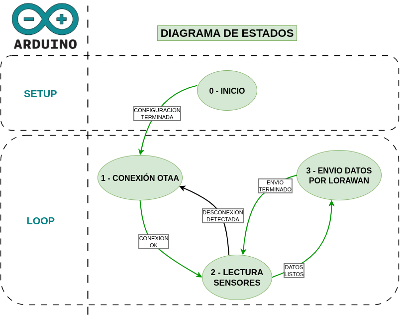

# Diagrama de estados esqueleto
El código en la carpeta /src contiene el esqueleto para envío de datos por LoRaWAN con la placa ESAAIOTV2.
El diagrama de estados es el que se muestra en la figura.

